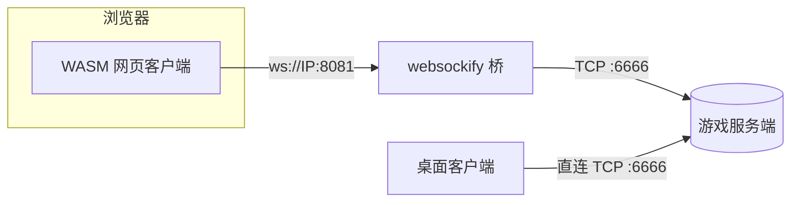

<div align="center">

# 🎮 GameEngine

**C++20 / SDL3 / Box2D 的学习型游戏框架**

[](https://en.cppreference.com/)
[](https://wiki.libsdl.org/SDL3)
[](https://box2d.org/)
[](https://cmake.org/)


[](LICENSE)

[](https://www.bilibili.com/video/BV1MBAezKEai/?spm_id_from=333.1387.homepage.video_card.click&vd_source=3a4ba49672dbd243312160a0bd307621)
[](https://minecraftbucuo.github.io/website/%E6%8A%80%E6%9C%AF%E7%9B%B8%E5%85%B3/%E4%B8%8D%E7%9F%A5%E5%8F%AB%E4%BB%80%E4%B9%88/GameEngine%E9%A1%B9%E7%9B%AE%E6%96%87%E6%A1%A3.html)

项目介绍、架构说明、设计决策见上方**详细文档**；本 README 只讲**构建、运行、部署**。

</div>

---

## 🚀 快速开始

### Linux（推荐用脚本）

```bash
chmod +x scripts/*.sh        # 首次：从 Windows 检出的脚本丢了执行位
./scripts/build.sh           # 交互：选构建目标（默认服务器版），再问是否连 Web 版一起构
./scripts/start_server.sh    # 一键开服：无头服务端 + websockify 桥（顺带发 WEB 页面）
```

`build.sh` 两个交互问题的含义：

| 提问 | 含义 |
|---|---|
| **构建目标** | 默认 `server`（无头服务端，服务器上跑这个）；`desktop` 需要图形开发包（X11 等），一般本地开发机用 |
| **是否构建 Web 版本** | 选 y 则额外产出 WASM 版本，需已安装 [emsdk](https://github.com/emscripten-core/emsdk)——自动探测 `EMSDK_ENV` → `~/emsdk` → `/opt/emsdk`，找不到会报错并给出安装命令 |

免交互写法：`./scripts/build.sh server web`（参数可任意组合 `server` / `desktop` / `web`）。

### Windows

```powershell
# 桌面版（CMake 会自动把 src/Asset 拷到 exe 旁）
cmake -S . -B build
cmake --build build --config Release
.\build\bin\GameEngine.exe

# Web 版（WASM，需要 emsdk；产物 build-web\web\ 四件套：html/js/wasm/data）
.\scripts\build_web.ps1

# 一键开服（服务端 exe 菜单开服 + websockify 桥 + 发 WEB 页面）
.\scripts\start_bridge.ps1
```

> [!IMPORTANT]
> Web 版预览必须走 http 服务器：`python -m http.server 8000 -d build-web\web`，浏览器访问 `http://localhost:8000/GameEngine.html`。
> **不能双击 html 用 file:// 打开**——浏览器会拦截 wasm/data 的 fetch。

---

## 🧱 构建目标与产物

| 目标 | 产物路径 | 说明 |
|---|---|---|
| **桌面版**（默认） | `build/bin/GameEngine` | 全功能客户端，启动进菜单 |
| **服务器版** `-DBUILD_FOR_SERVER=ON` | `build-server/server/GameEngineServer` | 无头，**启动即自动开服**（无菜单无渲染）；`build.sh` 会额外把 `src/Asset` 拷到 exe 同级（CMake 只给客户端拷，服务端要读 config.json） |
| **Web 版**（`emcmake` 配置） | `build-web/web/` 四件套 | WASM/Emscripten，资源打进 .data 虚拟盘 |

### CMake 开关

| 开关 | 默认 | 说明 |
|------|------|------|
| `BUILD_FOR_SERVER` | `OFF` | `ON` 构建无渲染/音频的无头服务端 |
| `BUILD_STATIC` | `ON` | 依赖全部静态链入 exe（单文件发布）；`OFF` 动态链接 |

> [!NOTE]
> 依赖要求：C++20 编译器、CMake 3.28+、git 与网络。首次配置 FetchContent 自动拉取 SDL3 全家与 Box2D 静态编译，之后离线可用。

---

## 🌐 联机部署速查

三种角色：

| 你想干嘛 | 用什么 | 详细文档 |
|---|---|---|
| 🖥️ 服务器上开服（Linux） | `./scripts/build.sh` + `./scripts/start_server.sh` | [web-multiplayer-deploy.md](docs/web-multiplayer-deploy.md) |
| 🪟 Windows 朋友开服 | exe 菜单「超级玛丽 Server」+ `.\scripts\start_bridge.ps1` | 同上（S1 节） |
| ☁️ 公网 VPS 长期部署 | nginx（TLS）+ systemd + websockify | 同上（S2 节） |



桥只服务网页玩家；桌面客户端 TCP 直连。**服务端对两种玩家一视同仁。**

---

## ⚙️ 配置

`src/Asset/config.json`（构建时拷到 exe 旁 / Web 版打进 .data 包）：

| 键 | 说明 |
|---|---|
| `window` | 窗口宽高、标题、帧率上限 |
| `network.serverIp` | 服务器地址。桌面客户端直连用；Web 版三形态：`auto`（连页面自身来源，配合桥发页面的拓扑零配置）/ 完整 `ws(s)://` URL / IP（自动拼桥端口 `webBridgePort`） |
| `network.port` | 游戏端口（默认 6666），桌面直连 & 桥的转发目标 |
| `network.webBridgePort` | 桥监听端口（默认 8081） |
| `network.tickRate` / `timeout` | 服务端同步频率 / 连接超时 |
| `game.*` | 重力、速度、跳跃力度、火球、Box2D 步长等参数 |

> [!TIP]
> `game.debug: true` 可叠加物理调试图（也可在游戏内「设置」里用调试模式开关）。
>
> 改配置有两个入口：
> 1. **游戏内「设置」界面**——窗口/网络/游戏参数运行时可改，保存即生效（窗口尺寸等标注重启生效）
> 2. **直接改 config.json 文件**——桌面版改 exe 旁的 `Asset/config.json` 即生效；Web 版该文件构建时打进 .data 包，改文件需重新构建
>
> 注意：Web 版「设置」的保存写入的是内存虚拟盘，**刷新页面后丢失**、不会写回 .data 包——需要长期变更仍走入口 2。

---

## ❓ 常见问题

<details>
<summary><b>首次构建很慢</b></summary>

FetchContent 在拉依赖（SDL3 全家 + Box2D），需要网络，之后有缓存。

</details>

<details>
<summary><b>Linux 上脚本报 <code>\r</code> 错误</b></summary>

换行符被转成 CRLF 了。`git add --renormalize .` 后重新提交（`.gitattributes` 已强制 `*.sh` 用 LF）。

</details>

<details>
<summary><b>Web 页面白屏 / 打不开</b></summary>

必须走 http 服务器，不能 file://。按 F12 看控制台报错。

</details>

<details>
<summary><b>网页玩家连不上</b></summary>

桥没起 / 防火墙没放行 8081 / `serverIp` 与拓扑不匹配（`auto` 仅限页面与桥同端口）。

</details>

<details>
<summary><b>服务端启动报找不到 config.json</b></summary>

用 `build.sh` 构建（会补拷 Asset），或手动把 `src/Asset` 拷到服务端 exe 同级。

</details>

---

## 📚 文档索引

| 文档 | 内容 |
|---|---|
| [web-multiplayer-deploy.md](docs/web-multiplayer-deploy.md) | WEB 联机部署：组件职责、S1 朋友开服、S2 VPS（nginx/systemd）、排障 |
| [websocket-net-plan.md](docs/websocket-net-plan.md) | WebSocket 联机方案：选型（A′）、风险、N0-N5 全记录 |
| [wasm-web-port-plan.md](docs/wasm-web-port-plan.md) | WASM 移植：决策记录、Step 0-9、体积基线 |
| [box2d-integration-plan.md](docs/box2d-integration-plan.md) | Box2D 接入设计与决策 |

---

<div align="center">

📄 **MIT License** · 详见 [LICENSE](LICENSE)

</div>
